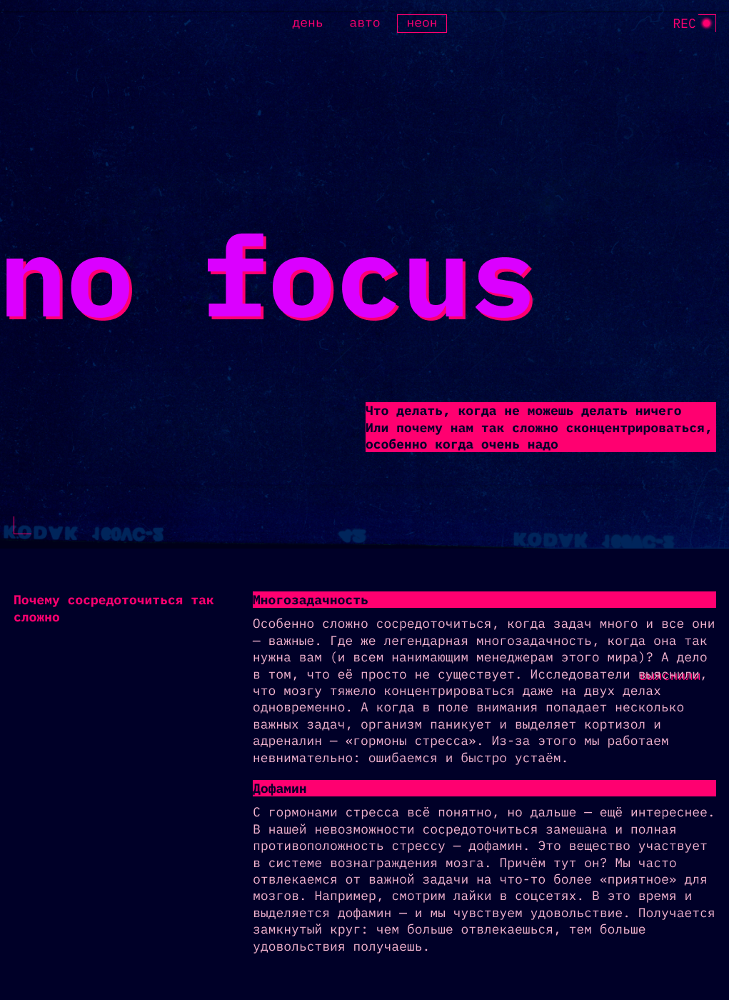
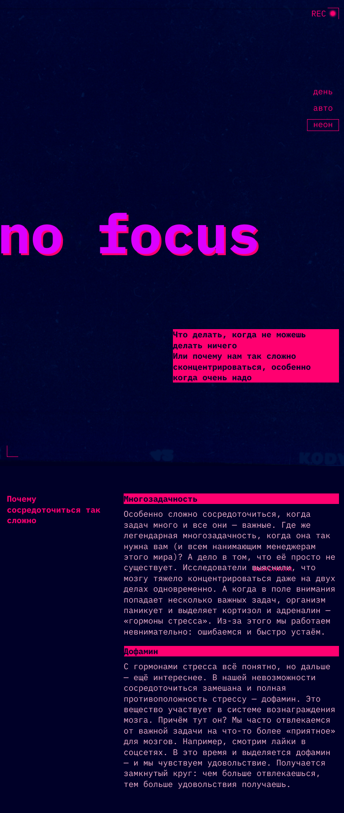
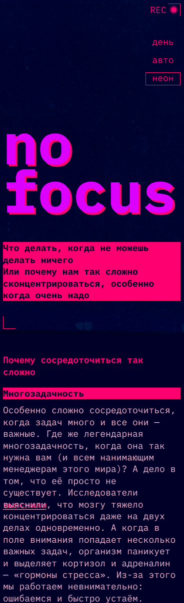

# Проект "Сложно сосредоточиться"

## Описание проекта
Данный проект представляет собой адаптивный сайт, реализованный в светлой и темной темах. Работа включает в себя верстку и стилизацию основной структуры сайта,  а также кнопок переключения тем.

## Планирование и подходы
- Рассмотрение проекта с точки зрения мобильного или десктопного первого подходов.
- Применены темные и светлые темы.
- Использованы гриды для удобства адаптивной верстки.

## Переменные
- Использование  переменных для хранения часто используемых цветов, шрифтов и отступов.
- Учет выбранной основной темы при определении цветовых переменных.

## Основной контент
- Разбиение текста на секции и определение структуры заголовков.
- Использование свойств гридов для адаптирования галереи.
- Использование функций clamp() для адаптива без медиазапросов.

## Футер
- Учет различий в стилях заголовков и правильное расположение декоративных элементов.

https://github.com/ytka98/slozhno-sosredotochitsya